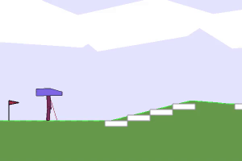

# Bipedal Walker Hardcore (and Classic) with SAC and TD3

Bipedal Walker environments of GYM are difficult problems to solve by reinforcement learning. 
work
In this repository, my thesis  is available. Various neural network architectures and RL methods implementations for solving BipedalWalker-v3 and BipedalWalkerHardcore-v3 of GYM on PyTorch using Soft Actor Critic (SAC) and Twin Delayed Deep Deterministic Policy Gradient (TD3). 

Only Hardcore environment is solved by SAC and TD3 algorithm. Reward is manipulated and frame rate is halved. 

## Neural Nets
- [x] Feed Forward Neural Network with Residual connection
- [x] Transformer (6 or 12 observation history as input)
- [x] Long Short Term Memory (6 or 12 observation history as input)

Only Hardcore environment is solved by TD3 and SAC algorithms. Reward is manipulated and frame rate is halved. 

# How to
Create new python environment and First install requirements. (python 3.6)

```bash
pip install -r requirements.txt
```

## Training

Train your model via following commands.

Train R. Feed Forward NN with SAC
```bash
python main_script.py -f train -r sac -m ff
```

Train Transformer (6 obs hist) with SAC
```bash
python main_script.py -f train -r sac -m trsf -hl 6
```

Train Transformer (12 obs hist) with SAC
```bash
python main_script.py -f train -r sac -m trsf -hl 12
```

Train LSTM (6 obs hist) with SAC
```bash
python main_script.py -f train -r sac -m lstm -hl 6
```

Train LSTM (12 obs hist) with SAC
```bash
python main_script.py -f train -r sac -m lstm -hl 12
```

-----------------------------------------------------------------------

Train R. Feed Forward NN with TD3
```bash
python main_script.py -f train -r td3 -m ff
```

Train Transformer (6 obs hist) with TD3
```bash
python main_script.py -f train -r td3 -m trsf -hl 6
```

Train LSTM (6 obs hist) with TD3
```bash
python main_script.py -f train -r td3 -m trsf -hl 12
```

## Simulating pretrained models
Download pretrained models from the following link and place onto models folder
https://drive.google.com/drive/folders/1BtqZXrJyuoBiyeE9IduWj7IkFN-urw6y?usp=sharing

Then run one of the following commands for best checkpoints,

```bash
python main_script.py -f test -r sac -m ff -c ep7600
```


```bash
python main_script.py -f test -r sac -m trsf -hl 6 -c ep6800
```


```bash
python main_script.py -f test -r sac -m lstm -hl 6 -c ep7600
```


```bash
python main_script.py -f test -r sac -m trsf -hl 12 -c ep6000
```


```bash
python main_script.py -f test -r sac -m lstm -hl 12 -c ep7200
```


```bash
python main_script.py -f test -r td3 -m ff -c ep6600
```


```bash
python main_script.py -f test -r td3 -m trsf -hl 6 -c ep6400
```


```bash
python main_script.py -f test -r td3 -m lstm -hl 6 -c ep7000
```


# Evaluation
To run a 100 episode gym evaluation with trained model, run following command

```bash
python main_script.py -f test-100 -r sac -m lstm -hl 12 -c ep7200
```

# Author

[](https://www.linkedin.com/in/ugurcanozalp/)

[](https://medium.com/@ugurcanozalp)

[](https://stackoverflow.com/users/11985314/u%c4%9fur-can-%c3%96zalp)
